# UCP Client-Server Communication Flow

This diagram illustrates how a client application communicates with a UCP (Universal Commerce Protocol) server to complete a purchase flow.

## Sequence Diagram

```mermaid
sequenceDiagram
    participant User
    participant Client
    participant Server
    participant Database

    Note over User,Database: STEP 0: DISCOVERY
    User->>Client: "I want to buy flowers"
    Client->>Server: GET /.well-known/ucp
    Server-->>Client: Discovery Response<br/>{capabilities, payment_handlers}
    Note over Client: Client learns:<br/>- Supports checkout, discounts, fulfillment<br/>- Payment: Shop Pay, Google Pay

    Note over User,Database: STEP 1: CREATE CHECKOUT
    Client->>Server: POST /checkout-sessions<br/>{line_items: [{id: "bouquet_roses", qty: 1}],<br/>buyer: {name, email}, payment: {handlers}}
    Server->>Database: Validate product "bouquet_roses"
    Database-->>Server: Product exists, price: $35.00
    Server->>Database: Create checkout session
    Database-->>Server: Checkout created (ID: abc123)
    Server-->>Client: Checkout Response<br/>{id: "abc123", line_items: [enriched],<br/>totals: [{subtotal: 3500}, {total: 3500}],<br/>status: "ready_for_complete"}
    Note over Client: Server enriched product data:<br/>- Added price: $35.00<br/>- Added full title<br/>- Calculated totals

    Note over User,Database: STEP 2: ADD MORE ITEMS
    User->>Client: "Add a ceramic pot"
    Client->>Server: PUT /checkout-sessions/abc123<br/>{line_items: [roses, pot_ceramic]}
    Server->>Database: Validate "pot_ceramic"
    Database-->>Server: Product exists, price: $15.00
    Server->>Database: Update checkout
    Database-->>Server: Updated
    Server-->>Client: Updated Checkout<br/>{totals: [{subtotal: 5000}, {total: 5000}]}
    Note over Client: New total: $50.00

    Note over User,Database: STEP 3: APPLY DISCOUNT
    User->>Client: "Use discount code 10OFF"
    Client->>Server: PUT /checkout-sessions/abc123<br/>{discounts: {codes: ["10OFF"]}}
    Server->>Database: Validate discount code
    Database-->>Server: 10OFF = 10% off
    Server->>Database: Apply discount & update
    Database-->>Server: Updated
    Server-->>Client: Updated Checkout<br/>{discounts: {applied: [{code: "10OFF",<br/>amount: 500}]},<br/>totals: [{subtotal: 5000},<br/>{discount: -500}, {total: 4500}]}
    Note over Client: Discount applied!<br/>New total: $45.00

    Note over User,Database: STEP 4: SELECT FULFILLMENT
    Client->>Server: PUT /checkout-sessions/abc123<br/>{fulfillment_address: {street, city, zip}}
    Server->>Database: Get shipping rates for address
    Database-->>Server: Available options
    Server-->>Client: Checkout with fulfillment_options:<br/>[{id: "std-ship", price: 500},<br/>{id: "express", price: 1500}]

    Client->>Server: PUT /checkout-sessions/abc123<br/>{fulfillment_option_id: "std-ship"}
    Server->>Database: Update with shipping
    Database-->>Server: Updated
    Server-->>Client: Final Checkout<br/>{totals: [{subtotal: 5000},<br/>{discount: -500},<br/>{shipping: 500},<br/>{total: 5000}]}
    Note over Client: Final total: $50.00<br/>(with shipping)

    Note over User,Database: STEP 5: COMPLETE PAYMENT
    User->>Client: "Complete purchase"
    Client->>Server: POST /checkout-sessions/abc123/complete<br/>{payment: {selected_instrument_id,<br/>payment_data}}
    Server->>Database: Validate payment
    Database-->>Server: Payment OK
    Server->>Database: Create Order
    Database-->>Server: Order created (ID: ord_xyz)
    Server-->>Client: Order Response<br/>{order_id: "ord_xyz",<br/>status: "confirmed"}
    Client-->>User: "Order confirmed! 🎉"

    Note over User,Database: STEP 6: CHECK ORDER STATUS
    Client->>Server: GET /orders/ord_xyz
    Server->>Database: Fetch order
    Database-->>Server: Order details
    Server-->>Client: Order Response<br/>{id: "ord_xyz",<br/>fulfillment: {status: "pending"}}
```



## Key Concepts

### 1. Discovery-Driven Integration

The client doesn't hard-code merchant capabilities. Instead:
- First call: `GET /.well-known/ucp` to discover what the merchant supports
- Response contains: capabilities, payment handlers, API versions
- Client adapts based on discovery data
- **Benefit**: One client works with any UCP merchant

### 2. Server-Side Data Enrichment

The client sends minimal product information:
```json
{
  "item": {
    "id": "bouquet_roses",
    "title": "Roses"
  }
}
```

The server enriches and validates:
```json
{
  "item": {
    "id": "bouquet_roses",
    "title": "Bouquet of Red Roses",
    "price": 3500,
    "image_url": "https://example.com/roses.jpg"
  }
}
```

**Benefits**:
- Price integrity (client can't manipulate prices)
- Consistent product data
- Server controls canonical information

### 3. Stateful Checkout Sessions

Each checkout session has a unique ID and maintains state:
- Created: `POST /checkout-sessions` → Returns `{id: "abc123"}`
- Updated: `PUT /checkout-sessions/abc123` → Modifies existing session
- Completed: `POST /checkout-sessions/abc123/complete` → Creates order

**State progression**:
```
incomplete → ready_for_complete → completed
```

### 4. Progressive Enhancement

The checkout builds up incrementally:

| Step | What's Added | Total |
|------|-------------|-------|
| 1. Initial | Roses ($35) | $35.00 |
| 2. Add item | + Ceramic pot ($15) | $50.00 |
| 3. Discount | - 10% off (-$5) | $45.00 |
| 4. Shipping | + Standard shipping ($5) | $50.00 |
| 5. Complete | Payment processed | Order created |

### 5. Server Calculates All Totals

The client never calculates prices. Every response includes:
```json
{
  "totals": [
    {"type": "subtotal", "amount": 5000},
    {"type": "discount", "amount": -500},
    {"type": "shipping", "amount": 500},
    {"type": "total", "amount": 5000}
  ]
}
```

**Benefits**:
- Prevents price manipulation
- Handles complex calculations (taxes, multi-tier discounts)
- Single source of truth

### 6. Idempotency & Request Tracking

Every request includes headers:
```http
request-id: 550e8400-e29b-41d4-a716-446655440000
idempotency-key: 7c9e6679-7425-40de-944b-e07fc1f90ae7
```

**Benefits**:
- Safe retries (network failures don't duplicate charges)
- Request tracing for debugging
- Prevents double-processing

## API Endpoints Used

| Endpoint | Method | Purpose |
|----------|--------|---------|
| `/.well-known/ucp` | GET | Discover merchant capabilities |
| `/checkout-sessions` | POST | Create new checkout session |
| `/checkout-sessions/{id}` | GET | Retrieve checkout session |
| `/checkout-sessions/{id}` | PUT | Update checkout (add items, discounts, address) |
| `/checkout-sessions/{id}/complete` | POST | Complete checkout & create order |
| `/orders/{id}` | GET | Retrieve order details |
| `/orders/{id}` | PUT | Update order (merchant use) |

## Example: Discovery Response

```json
{
  "ucp": {
    "version": "2026-01-11",
    "services": {
      "dev.ucp.shopping": {
        "rest": {
          "endpoint": "http://localhost:8182/"
        }
      }
    },
    "capabilities": [
      {"name": "dev.ucp.shopping.checkout"},
      {"name": "dev.ucp.shopping.discount"},
      {"name": "dev.ucp.shopping.fulfillment"}
    ]
  },
  "payment": {
    "handlers": [
      {
        "id": "shop_pay",
        "name": "dev.shopify.shop_pay",
        "instrument_schemas": ["..."]
      },
      {
        "id": "google_pay",
        "name": "com.google.pay",
        "instrument_schemas": ["..."]
      }
    ]
  }
}
```

## Example: Create Checkout Request

```bash
curl -X POST http://localhost:8182/checkout-sessions \
  -H "UCP-Agent: profile=\"https://agent.example/profile\"" \
  -H "request-signature: test" \
  -H "idempotency-key: 550e8400-e29b-41d4-a716-446655440000" \
  -H "request-id: 7c9e6679-7425-40de-944b-e07fc1f90ae7" \
  -H "Content-Type: application/json" \
  -d '{
    "line_items": [{
      "item": {
        "id": "bouquet_roses",
        "title": "Roses"
      },
      "quantity": 1
    }],
    "buyer": {
      "full_name": "Jane Doe",
      "email": "jane@example.com"
    },
    "currency": "USD",
    "payment": {
      "instruments": [],
      "handlers": []
    }
  }'
```

## Example: Create Checkout Response

```json
{
  "ucp": {
    "version": "2026-01-11",
    "capabilities": [{"name": "dev.ucp.shopping.checkout"}]
  },
  "id": "b8d14106-0730-4d53-8ef3-4650dad8905e",
  "line_items": [{
    "id": "e5df4cad-e229-4cbe-a29e-69e94f4ec12b",
    "item": {
      "id": "bouquet_roses",
      "title": "Bouquet of Red Roses",
      "price": 3500,
      "image_url": null
    },
    "quantity": 1,
    "totals": [
      {"type": "subtotal", "amount": 3500},
      {"type": "total", "amount": 3500}
    ]
  }],
  "buyer": {
    "full_name": "Jane Doe",
    "email": "jane@example.com"
  },
  "status": "ready_for_complete",
  "currency": "USD",
  "totals": [
    {"type": "subtotal", "amount": 3500},
    {"type": "total", "amount": 3500}
  ],
  "payment": {
    "handlers": [],
    "instruments": []
  }
}
```

Notice how the server:
- Added a checkout `id`
- Added line item `id`
- Enriched the product (full title, price)
- Calculated totals
- Set status to `ready_for_complete`

## Testing the Flow

### Option 1: Automated Test Client

```bash
cd C:\Users\user\Documents\Workspace\ai\samples\rest\python\client\flower_shop
.venv\Scripts\python.exe simple_happy_path_client.py --server_url=http://localhost:8182
```

This runs through all steps automatically and shows the complete flow.

### Option 2: Manual Testing

1. **Start the server**:
   ```bash
   cd C:\Users\user\Documents\Workspace\ai\samples\rest\python\server
   .venv\Scripts\python.exe server.py --products_db_path=../ucp_test/products.db --transactions_db_path=../ucp_test/transactions.db --port=8182
   ```

2. **Test discovery**:
   ```bash
   curl http://localhost:8182/.well-known/ucp
   ```

3. **Create checkout** (use the curl example above)

4. **Watch server logs** to see real-time request processing

## Additional Resources

- **QUICKSTART.md** - Step-by-step setup guide
- **server/README.md** - Detailed server documentation
- **UCP Specification** - https://ucp.dev
- **Test Client Code** - `client/flower_shop/simple_happy_path_client.py`

## License

Apache License 2.0 - Copyright 2026 UCP Authors
